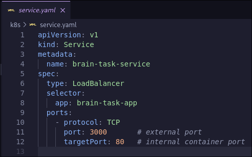
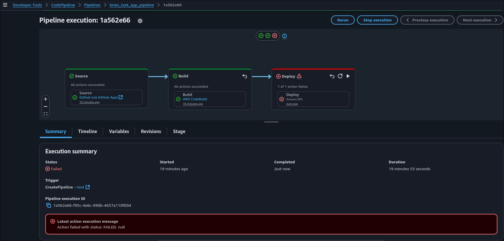

# Deploying a React application toa production ready state

## Step 01

### clone the repo

```
git clone https://github.com/Vennilavan12/Brain-Tasks-App.git

```
## Step 02

### Dockerize the application


## Step 03

### Build the image 


## Step 04

### Create a aws ecr repository to store docker images


## Step 05

### Setup Kubernetes cluster


## Step 06

### write a deployment and service yaml file




## Step 07

### create appspec.yml and buildspec.yml


## Step 08

### upload to github

```
git add .
git commmit -m "Initial commit"
git push origin main

```


## Step 08

### deploy using kubectl using codedeploy




## Step 09

### check application output


